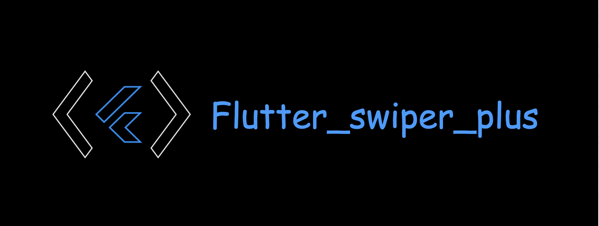

<p align="center">
    <a href="https://github.com/mimajiushi/flutter_swiper_plus/blob/master/README-ZH.md">
        <b>中文说明</b>
    </a>
</p>

# flutter_swiper_plus

The best swiper for flutter , with multiple layouts, infinite loop. Compatible with Android & iOS.

> If you need run on flutter that version before 2.0, see：[flutter_swiper](https://github.com/best-flutter/flutter_swiper)

---

# Show Case

- Horizontal


- Vertical

  
- Horizontal & Vertical in part

  
- Imitating BiliBili's (with text)
  - flutter_swiper_plus👇：
  - 
  - BiliBili's👇：
  - 

- Imitate mobile page


  
---

# Different Transformers

- You can override 'PageTransformer' to customize the animation ，see[`buildin_transformers.dart`](https://github.com/mimajiushi/flutter_swiper_plus/blob/master/lib/src/transformer_page_view/buildin_transformers.dart)
- The existing animation is shown below 👇：
  
  
> you can run [`main.dart`](https://github.com/mimajiushi/flutter_swiper_plus/blob/master/example/lib/main.dart)in example to see the actual effect.

---

# Different layouts

- This part is currently controlled by enum, It can be previewed in the `Custom All` of the example project
- The following is a demonstration 👇：
  

> you can run [`main.dart`](https://github.com/mimajiushi/flutter_swiper_plus/blob/master/example/lib/main.dart)in example to see the actual effect.

- Very easy to create you own custom animation, like this👇:
```

 new Swiper(
  layout: SwiperLayout.CUSTOM,
  customLayoutOption: new CustomLayoutOption(
      startIndex: -1,
      stateCount: 3
  ).addRotate([
    -45.0/180,
    0.0,
    45.0/180
  ]).addTranslate([
    new Offset(-370.0, -40.0),
    new Offset(0.0, 0.0),
    new Offset(370.0, -40.0)
  ]),
  itemWidth: 300.0,
  itemHeight: 200.0,
  itemBuilder: (context, index) {
    return new Container(
      color: Colors.grey,
      child: new Center(
        child: new Text("$index"),
      ),
    );
  },
  itemCount: 10)

```

- The `CustomLayoutOption` is designed to describe animations. It is very easy to specify every state of items in Swiper, like this👇：

```
new CustomLayoutOption(
      startIndex: -1,  /// 开始下标
      stateCount: 3    /// 下面的数组长度 
  ).addRotate([        //  每个元素的角度
    -45.0/180,
    0.0,
    45.0/180
  ]).addTranslate([           /// 每个元素的偏移
    new Offset(-370.0, -40.0),
    new Offset(0.0, 0.0),
    new Offset(370.0, -40.0)
  ])

```

---

# change log

- See：[CHANGELOG.md](https://github.com/mimajiushi/flutter_swiper_plus/blob/master/CHANGELOG.md)

---

# quick start

- [Installation](#installation)
- [Simple_Demo](#Simple_Demo)
- [Constructor](#constructor)
  + [Basic](#basic)
  + [Pagination](#pagination)
  + [Control buttons](#control-buttons)
  + [Controller](#controller)
  + [Autoplay](#autoplay)

## installation

in `pubspec.yaml`, write this👇：

```yaml
dependencies:
  flutter_swiper : ^lastest_version
```

then run this👇 in your project root：

```bash
flutter packages get 
```

---

## Simple_Demo

```dart
import 'package:flutter/material.dart';
import 'package:flutter_swiper_plus/flutter_swiper_plus.dart';

void main() => runApp(new MyApp());

class MyApp extends StatelessWidget {
  @override
  Widget build(BuildContext context) {
    return new MaterialApp(
      title: 'Flutter Demo',
      theme: new ThemeData(
        primarySwatch: Colors.blue,
      ),
      home: new MyHomePage(title: 'Flutter Demo Home Page'),
    );
  }
}

class MyHomePage extends StatefulWidget {
  MyHomePage({Key? key, required this.title}) : super(key: key);

  final String title;

  @override
  _MyHomePageState createState() => new _MyHomePageState();
}

class _MyHomePageState extends State<MyHomePage> {

  @override
  Widget build(BuildContext context) {
    return new Scaffold(
      appBar: new AppBar(
        title: new Text(widget.title),
      ),
      body:  new Swiper(
        itemBuilder: (BuildContext context,int index){
          return new Image.network("http://via.placeholder.com/350x150",fit: BoxFit.fill,);
        },
        itemCount: 3,
        pagination: new SwiperPagination(),
        control: new SwiperControl(),
      ),
    );
  }
}
```

---

## Constructor

### Basic

| Parameter  | Default   | Description |
| :------------ |:---------------:| :-----|
| scrollDirection | Axis.horizontal  | If `Axis.horizontal`, the scroll view's children are arranged horizontally in a row instead of vertically in a column. |
| loop | true |Set to `false` to disable continuous loop mode. |
| index | 0 |  Index number of initial slide. |
| autoplay | false |Set to `true` enable auto play mode. |
| onIndexChanged | void onIndexChanged(int index)  | Called with the new index when the user swiped or autoplay |
| onTap | void onTap(int index)  | Called when user tap ui. |
| duration | 300.0  | The milliscends of every transaction animation costs  |
| pagination | null | set `new SwiperPagination()` to show default pagination
| control | null | set `new SwiperControl()` to show default control buttons


---

### Pagination

The pagination extends from `SwiperPlugin`,the `SwiperPlugin` provides extra ui for `Swiper`.Set `new SwiperPagination()` to show default pagination.


| Parameter  | Default   | Description |
| :------------ |:---------------:| :-----|
| alignment | Alignment.bottomCenter  | Change this value if you what to put pagination in other place |
| margin | const EdgeInsets.all(10.0) | The distance between inner side of the parent container. |
| builder | SwiperPagination.dots | There are two default styles `SwiperPagination.dots` and `SwiperPagination.fraction`,both can be customized. |

If you'd like to customize your own pagination, you can do like this:

```
new Swiper(
    ...,
    pagination:new SwiperCustomPagination(
        builder:(BuildContext context, SwiperPluginConfig config){
            return new YourOwnPaginatipon();
        }
    )
);
```

---

### Control buttons

The control also extends from `SwiperPlugin`,set `new SwiperControl()` to show default control buttons.

| Parameter  | Default   | Description |
| :------------ |:---------------:| :-----|
| iconPrevious | Icons.arrow_back_ios  | The icon data to display `previous` control button |
| iconNext | Icons.arrow_forward_ios | The icon data to display `next`. |
| color | Theme.of(context).primaryColor | Control button color |
| size | 30.0 | Control button size |
| padding | const EdgeInsets.all(5.0) | Control button padding |

---

### Controller

The `Controller` is used to control the `index` of the Swiper, start or stop autoplay.You can create a controller by `new SwiperController()` and save the instance by futher usage.

| Method  | Description |
| :------------ |:-----|
| void move(int index, {bool animation: true}) | Move to the spicified `index`,with animation or not |
| void next({bool animation: true}) | Move to next |
| void previous({bool animation: true}) | Move to previous |
| void startAutoplay() | Start autoplay |
| void stopAutoplay() | Stop autoplay |

---

### Autoplay

| Parameter  | Default   | Description |
| :------------ |:---------------:| :-----|
| autoplayDelay | 3000  | Autoplay delay milliseconds. |
| autoplayDisableOnInteraction | true | If set true, `autoplay` is disabled when use swipes. |

